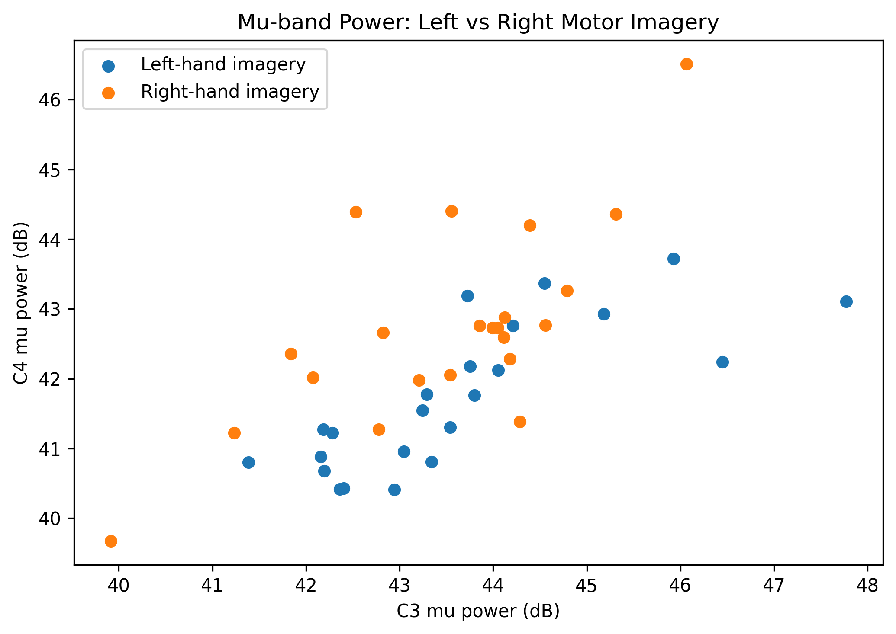
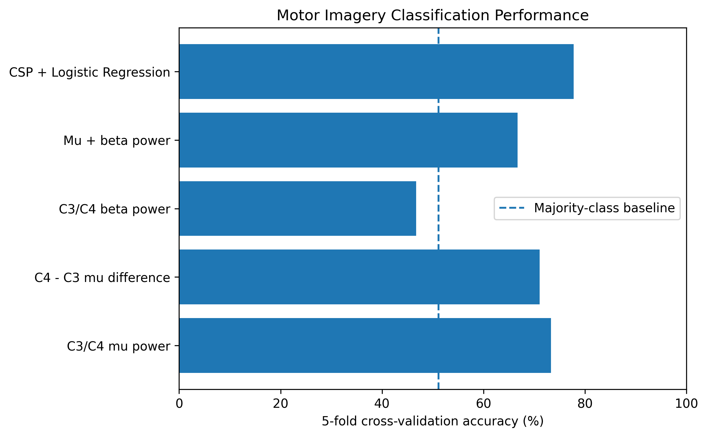
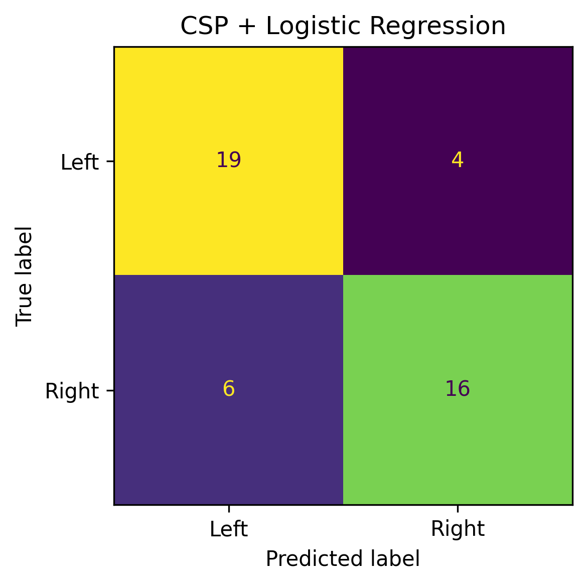

# EEG Motor Imagery Classification

Machine learning project for classifying imagined left- vs right-hand movements from multichannel EEG recordings.

The project compares simple physiologically motivated spectral features with Common Spatial Patterns (CSP) for within-subject motor-imagery classification.

## Dataset

The project uses the [PhysioNet EEG Motor Movement/Imagery Dataset](https://physionet.org/content/eegmmidb/1.0.0/).

The analysis focuses on:

- Subject 1
- 64 EEG channels
- Sampling frequency: 160 Hz
- Runs 4, 8, and 12
- Left- vs right-fist motor imagery
- 45 motor-imagery trials in total:
  - 23 left-hand trials
  - 22 right-hand trials

The recordings are downloaded automatically through MNE.

## Analysis Pipeline

The notebook follows this workflow:

1. Load and explore a single EEG recording.
2. Standardize EEG channel names and assign a standard 10–05 electrode montage.
3. Combine runs 4, 8, and 12.
4. Extract 4-second left- and right-hand motor-imagery epochs.
5. Compute Power Spectral Density (PSD) at the C3 and C4 sensorimotor electrodes.
6. Extract mu-band (8–13 Hz) and beta-band (13–30 Hz) power features.
7. Train logistic-regression classifiers using several handcrafted feature sets.
8. Band-pass filter the EEG between 8 and 30 Hz.
9. Extract Common Spatial Pattern (CSP) features from all 64 EEG channels.
10. Evaluate the models using stratified 5-fold cross-validation.

## Models and Results

| Method | Mean 5-fold CV accuracy |
| --- | ---: |
| C3/C4 mu power | 73.3% |
| C4 - C3 mu difference | 71.1% |
| C3/C4 beta power | 46.7% |
| Mu + beta power | 66.7% |
| **CSP + Logistic Regression** | **77.8%** |

The majority-class baseline for this dataset is approximately **51.1%**.

The results suggest that mu-band spatial information contains useful information for distinguishing left- and right-hand motor imagery.

CSP achieved the highest cross-validated accuracy by learning spatial combinations of all 64 EEG channels rather than relying only on C3 and C4.

## Results Visualization

### Mu-band Feature Space



Each point represents one motor-imagery trial using C3 and C4 mu-band power as features.

### Model Comparison



### CSP Confusion Matrix



The CSP + logistic-regression model correctly classified 35 of the 45 trials during cross-validation.

## Common Spatial Patterns

Common Spatial Patterns (CSP) is an EEG-specific spatial feature-extraction method.

Instead of selecting individual electrodes manually, CSP learns weighted combinations of EEG channels whose signal variance differs strongly between the two classes.

Because variance in band-pass-filtered EEG is related to oscillatory power, CSP is particularly useful for motor-imagery decoding.

In this project, four CSP components are extracted from EEG filtered between 8 and 30 Hz and used as features for logistic regression.

## Limitations

This project is an exploratory within-subject analysis and should not be interpreted as a general EEG decoding benchmark.

Important limitations include:

- only one participant was analyzed;
- the dataset contains only 45 motor-imagery trials;
- evaluation uses trial-level cross-validation;
- trials from the same recording run may therefore appear in both training and test folds;
- only a limited number of feature representations and model configurations were explored.

Future work could include:

- leave-one-run-out validation;
- analysis across multiple subjects;
- additional EEG preprocessing and feature-extraction methods;
- hyperparameter optimization;
- comparison with neural-network models.

## Project Structure

```text
eeg-motor-imagery/
├── notebooks/
│   └── 01_explore_data.ipynb
├── figures/
│   ├── mu_power_scatter.png
│   ├── model_comparison.png
│   └── csp_confusion_matrix.png
├── .gitignore
└── README.md
```

## Dependencies

The project uses:

- Python
- MNE
- NumPy
- pandas
- Matplotlib
- scikit-learn
- Jupyter
- ipykernel

## How to Reproduce

Clone the repository:

```bash
git clone https://github.com/IsmaelDiop/eeg-motor-imagery.git
cd eeg-motor-imagery
```

Create a virtual environment:

```bash
python -m venv .venv
```

On Windows PowerShell, activate it with:

```powershell
.\.venv\Scripts\Activate.ps1
```

Install the required packages:

```bash
pip install -r requirements.txt
```

Open:

```text
notebooks/01_explore_data.ipynb
```

and run the notebook from top to bottom.

The EEGBCI recordings are downloaded automatically by MNE when the notebook is first run.